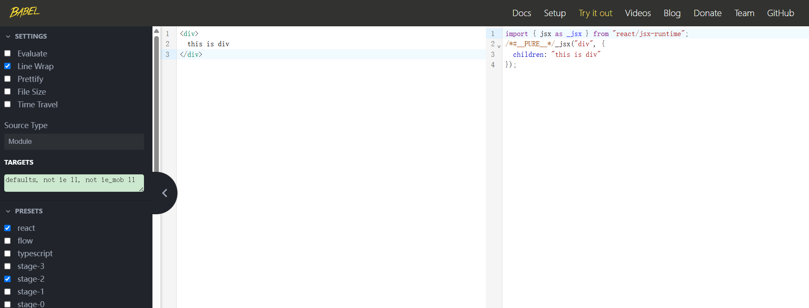

# React18

## 开发环境搭建

### 1.使用 `create-react-app`

使用`create-react-app` 快速搭建开发环境

`create-react-app` 是一个快速创建React开发环境的工具，底层由webpack构建，封装了配置细节，开箱即用。

执行命令：

```bash
# 全局安装 create-react-app
npm install -g create-react-app
# 创建一个新的react应用
create-react-app my-app
# 运行你的应用
cd my-app
npm start
```

### 2.使用Vite

Vite 是一个新兴的现代化前端构建工具，它提供了快速的冷启动和即时模块热更新。

```bash
# 创建vite项目
npm create vite@latest my-vite-app -- --template react
# 或
yarn create vite my-vite-app -- --template react
# 进入项目目录并安装
cd my-vite-app
npm install  # 或 yarn install
# 运行你的应用
npm run dev  # 或 yarn dev
```

### 3.使用 Webpack 和 Babel（手动配置）

如果你想要更高级的配置能力，你可以手动设置Webpack和Babel。这种方法提供了最大的灵活性，但也需要更多的配置工作。

1. 初始化项目

   ```bash
   mkdir my-custom-react-app && cd my-custom-react-app
   npm init -y
   ```

2. 安装依赖

   ```bash
   npm install react react-dom --save
   npm install @babel/core @babel/preset-env @babel/preset-react babel-loader --save-dev
   npm install webpack webpack-cli webpack-dev-server html-webpack-plugin --save-dev
   npm install --save-dev style-loader css-loader babel-loader @babel/preset-react @babel/preset-env html-webpack-plugin clean-webpack-plugin copy-webpack-plugin terser-webpack-plugin css-minimizer-webpack-plugin mini-css-extract-plugin
   ```

3. 配置 Babel（在项目根目录创建 `.babelrc` 或 `babel.config.json`）

   ```json
   {
     "presets": ["@babel/preset-env", "@babel/preset-react"]
   }
   ```

4. 配置 Webpack（在项目根目录创建 `webpack.config.js`）

   ```js
   const path = require('path');
   const HtmlWebpackPlugin = require('html-webpack-plugin');
   const { CleanWebpackPlugin } = require('clean-webpack-plugin'); // 清理/dist文件夹（可选）
   // 更多配置...（根据你的需求添加）... 例如入口、输出、loader等配置。 参考官方文档。 示例省略详细配置以保持简洁。 详细配置请查阅Webpack文档。 确保至少包含HTML模板插件和Babel loader。 示例省略详细配置以保持简洁。 详细配置请查阅Webpack文档。 确保至少包含HTML模板插件和Babel loader。 示例省略详细配置以保持简洁。 详细配置请查阅Webpack文档。 确保至少包含HTML模板插件和Babel loader。 示例省略详细配置以保持简洁。 详细配置请查阅Webpack文档。 确保至少包含HTML模板插件和
   ```

创建React项目的更多方式：https://zh-hans.react.dev/learn/start-a-new-react-project

## JSX基础

### 概念和本质

概念：JSX是JavaScript和XML（HTML）的缩写，表示**在JS代码中编写HTML模板结构**，它是React中编写UI模板的方式。

```jsx
const message = 'this is message';
function App() {
  return (
    <div>
      <h1>this is title</h1>
      {message}
    </div>
  )
}
```

优势：

1. HTML的声明式写法
2. JS的可编程能力

本质：JSX并不是标准的JS语法，它是**JS的语法扩展**，浏览器本身不能识别，需要通过**解析工具（babel）做解析**之后才能在浏览器中运行。

[babel编译](https://babeljs.io/repl#?browsers=defaults%2C%20not%20ie%2011%2C%20not%20ie_mob%2011&build=&builtIns=false&corejs=3.21&spec=false&loose=false&code_lz=DwEwlgbgfAUABHALgCzAZzuu4I2AehyiA&forceAllTransforms=false&modules=false&shippedProposals=false&evaluate=false&fileSize=false&timeTravel=false&sourceType=module&lineWrap=true&presets=env%2Creact%2Cstage-2&prettier=false&targets=&version=7.27.0&externalPlugins=&assumptions=%7B%7D)



### 识别js表达式

在JSX中可以通过 **大括号语法{}** 识别JavaScript中的表达式，比如常见的变量、函数调用、方法调用等等

1. 使用引号传递字符串
2. 使用JavaScript变量
3. 函数调用和方法变量
4. 使用JavaScript对象

```jsx
const count = 100;
function getName() {
  return 'jack'
}
function App() {
  return (
    <div className="App">
      this is app
      {/* 使用引号传递字符串 */}
      { 'this is message' }
      {/* 识别js变量 */}
      { count }
      {/* 函数调用 */}
      { getName() }
      {/* 方法调用 */}
      { new Date().getDate() }
      {/* 使用js对象 */}
      <div style={{ color: 'red' }}>this is div</div>
    </div>
  );
}

export default App;
```

注意：if语句、switch语句、变量声明属于语句，不是表达式，不能出现在{}中。

### JSX中实现列表渲染

